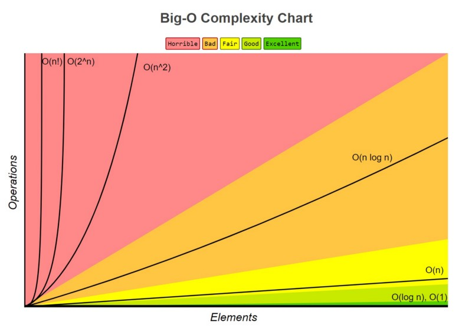
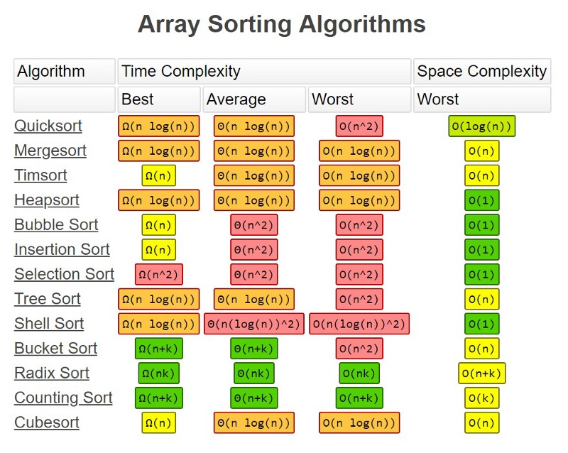

# Algoritmi e Strutture Dati


## 1. Introduzione

Algoritmi e strutture dati sono sempre stati connessi tra loro, difficile trattare un argomento ignorando l'altro. Negli anni, con le nuove tecnologie, nuovi frameworks, si sono moltiplicati sia l'uno che l'altro, ma le basi su cui impostare una discussione sono sempre quelle: collezioni e algoritmi di ricerca e ordinamento.

Probabilmente perché queste sono le operazioni più comuni e più facilmente misurabili in funzione del tempo e delle risorse consumate. Naturalmente i frameworks contengono metodi di ordinamento sulle collezioni già pronti all'uso, ma capire quali sono e perché utilizzano proprio quel determinato tipo di algoritmo, completa la comprensione dell'argomento. 

#### 1.1 Strutture dati

Una [struttura dati](https://it.wikipedia.org/wiki/Lista_di_strutture_dati) è un'entità usata per organizzare un insieme di dati all'interno della memoria del computer, ed eventualmente per memorizzarli in una memoria di massa. La scelta delle strutture dati da utilizzare è strettamente legata a quella degli [algoritmi](https://it.wikipedia.org/wiki/Algoritmo); per questo, spesso essi vengono considerati insieme. Infatti, la scelta della struttura dati influisce inevitabilmente sull'efficienza degli algoritmi che la manipolano.

La struttura dati è un metodo di organizzazione dati, quindi prescinde dai ciò che è effettivamente contenuto. Ciascun linguaggio di programmazione offre strumenti, più o meno sofisticati, per definire strutture dati, ovvero aggregare dati di tipo omogeneo o eterogeneo. Questi strumenti sono tipicamente componibili.

Più formalmente, i linguaggi forniscono un insieme predefinito di tipi di dato elementari, e le strutture dati sono strumenti per costruire tipi di dati aggregati più complessi.

| Struttura&nbsp;&nbsp;&nbsp;&nbsp;&nbsp; | Vantaggi                                                     | Svantaggi                                                    |
| --------------------------------------- | ------------------------------------------------------------ | ------------------------------------------------------------ |
| **Array**                               | inserimento rapido, accesso veloce ad un elemento se si conosce l'indice | ricerca e cancellazione lenti, dimensioni fisse              |
| **Ordered Array**                       | ricerca più rapida di un array non ordinato                  | inserimento e cancellazione lenti, dimensioni fisse          |
| **Stack**                               | LILO: last in, last out                                      | lento accesso agli altri elementi                            |
| **Queue**                               | FIFO: first in, first out                                    | lento accesso agli altri elementi                            |
| **Linked List**                         | inserimento e cancellazione veloci                           | ricerca lenta                                                |
| **Binary Tree**                         | ricerca, inserimento, cancellazione veloci se l'albero rimane bilanciato | l'algoritmo di cancellazione è complesso                     |
| **RB Tree**                             | è sempre bilanciato, ricerca, inserimento, cancellazione veloci | complesso                                                    |
| **2-3-4 Tree**                          | è sempre bilanciato, ricerca, inserimento, cancellazione veloci | complesso                                                    |
| **Hash Table**                          | inserimento rapido, accesso veloce ad un elemento se si conosce la chiave | cancellazione lenta, accesso lento se non si conosce la chiave, inefficiente nell'uso della memoria |
| **Heap**                                | inserimento e cancellazione veloci, facile accesso all'elemento maggiore | accesso lento per gli altri elementi                         |
| **Graph**                               | modella situazioni reali                                     | alcuni algoritmi sono lenti e complessi                      |


#### 1.2 Algoritmi

Questo non è un elenco degli algoritmi trattati, ma la lista delle operazioni principali che molti algoritmi sono chiamati a compiere sulle strutture dati

1. Inserimento di un elemento
2. Cancellazione di un elemento
3. Cercare un elemento all'interno della struttura
4. Ordinare la struttura in base ad una proprietà degli elementi

Gli algoritmi sono numerosi, troppo numerosi per poter esser elencati e trattati a fondo, anche perché difficilmente ti verrà chiesto di implementare un algoritmo di ordinamento o di ricerca, ma più comunemente ogni volta che userai il metodo `sort`su una collezione, avrai modo di comprendere come funzionano le cose e magari poter pensare di utilizzare un algoritmo diverso poiché le collezioni che utilizzi hanno proprietà che rendono altri algoritmi maggiormente performanti rispetto a quelli utilizzati dal framework.

Trattare gli algoritmi di ordinamento è semplice perché viene naturale misurarne le prestazioni in funzione del tempo e della grandezza dell'insieme di elementi su cui operano.

#### 1.3 O-grande ( Big-O )

La notazione matematica **O-grande** è utilizzata per descrivere il comportamento asintotico delle funzioni. Il suo obiettivo è quello di caratterizzare il comportamento di una funzione per argomenti elevati in modo semplice ma rigoroso, al fine di poter confrontare il comportamento di più funzioni fra loro. Più precisamente, è usata per descrivere un limite asintotico superiore per la magnitudine di una funzione rispetto ad un'altra, che solitamente ha una forma più semplice.

In parole povere, O-grande si può leggere come "dello stesso ordine di", "si comporta come la funzione X" e rappresenza un **limite superiore**, mentre per esprimere un **limite inferiore**, si utilizza **Ω** ( Omega grande ). Per esprimere un limite in cui O e Ω coincidono, si utilizza la notazione **Θ** (Theta grande) per descrivere un **limite asintotico stretto**.

Attraverso questa notazione si possono quindi valutare le performance di un algoritmo in funzione della quantità di elementi che appartengono alla collezione su cui opera



È importante tenere a mente, che non esiste un algoritmo che è il più veloce in tutti i casi, poiché la loro prestazione dipende sempre dalla collezione su cui operano, da quanti elementi è composta, se è parzialmente ordinata e così via. Ogni algoritmo ha quindi un "caso migliore" ed un "caso peggiore" su cui dover operare e su cui avranno quindi le migliori o le peggiori performance. Inoltre, non è detto che per valutare la qualità di un algoritmo sia sufficiente valutarne la velocità, a volte occorre tener conto anche dello spazio occupato per l'elaborazione dei dati.



## 2. Array

Un **array** (detto anche **vettore** o **matrice**) indica una struttura dati complessa, **statica** e **omogenea** ovvero  contiene un numero finito di elementi tutti dello stesso tipo. Questi elementi sono individuati attraverso un indice numerico, che tipicamente va da 0 al numero massimo di elementi meno uno

Gli array, sono ispirati alla nozione matematica di [vettore](https://it.wikipedia.org/wiki/Vettore_(matematica)) (quando monodimensionali) o di [matrice](https://it.wikipedia.org/wiki/Matrice) (nel caso di array bidimensionali). L'array è in genere classificato come un costruttore di tipo: in altre parole, esso consente di definire nuovi tipi di dati a partire da tipi preesistenti, attraverso l'aggregazione di diversi oggetti tutti di uno stesso tipo. Ciascun oggetto componente è individuato attraverso un *indice* intero, nel caso monodimensionale, o attraverso *D* indici interi nel caso *D*-dimensionale.

#### 2.1 Definire un Array in Kotlin

Ho un po' di nostalgia degli anni 80' solo per quanto riguarda il calcio, il gioco. Non per i grandi risultati sportivi ottenuti dalla mia squadra, ma quando piuttosto perché i numeri delle maglie erano sequenziali ed identificavano immediatamente il ruolo di un giocatore. Questa breve premessa, prima di iniziare era dovuta, visto che prenderò come esempio la formazione del Milan che vinse la Coppa Campioni nella stagione 88/89.

Come sai, il tipo di una variabile dipende anche dalla sua nullabilità, questo ci interessa relativamente ora, ma per dichiarare un array vuoto occorre decidere se un elemento può essere nullo o meno poichè, come detto precedentemente, un array contiene tipi omogenei. Quindi una squadra si può definire così:

```kotlin
val squadra = arrayOfNulls<Giocatore?>(11) //accetta null
val squadra = Array(11, { i -> Giocatore() }) // array inizializzato con una lambda function
```

La classe Giocatore è definita come segue, dove i valori null sono ammessi per identificare un ruolo nella squadra ancora da assegnare
```kotlin
data class Giocatore(val nome: String? = null, val maglia: Int? = null)
```

Si può definire un array anche passandogli direttamente gli elementi che lo compongono, nel caso l'array squadra può essere creato nel seguente modo
```kotlin
val milan = arrayOf(
        Giocatore("Galli", 1),
        Giocatore("Tassotti", 2),
        Giocatore("Maldini", 3),
        Giocatore("Colombo", 4),
        Giocatore("Costacurta", 5),
        Giocatore("Baresi", 6),
        Giocatore("Donadoni", 7),
        Giocatore("Rijkaard", 8),
        Giocatore("Van Basten", 9),
        Giocatore("Gullit", 10),
        Giocatore("Ancelotti", 11)
    )
```

in Kotlin esistono anche un tipo particolare di Array, quelli di tipo primitivo `ByteArray`, `ShortArray`, `IntArray` e così via, che non hanno nessuna relazione ereditaria con `Array`, ma ne hanno le stesse proprietà e gli stessi metodi con le rispettive funzioni factory `byteArrayOf()`, `shortArrayOf()` ...

Attenzione che il tipo non è equivalente ad un `Array`, ovvero `IntArray(11)` non è dello stesso tipo di `Array(11, {i -> 0})`, proprio per quanto detto sulla loro relazione qui sopra.

#### 2.2 Classe List

C'è un modo migliore per gestire le strutture dati di tipo vettore in Kotlin ( e  Java ), e viene fornito dal package Collections di Java 8: l'interfaccia `List`. L'interfaccia `List`e la sua implementazione `ArrayList` si dividono in mutabile o immutabile, dove quest'ultima indica che non è possibile aggiungere o togliere elementi. Viene meno la staticità dei vettori, rimane però d'obbligo la omogeneità.

```kotlin
val a = List(11, { i -> Giocatore()}) // lista di 11 elementi inizializzata
val b = mutableListOf<Giocatore>() // lista vuota ma mutabile, permette ADD
val c = listOf(Giocatore("Galli", 1), Giocatore("Tassotti", 2)) //inizializzata con valori
```

La correlazione tra `Array` e `List`, anche se appartengono a package differenti, è così stretta che passare da uno all'altro è semplicissimo

```kotlin
val list: List<Giocatore> = array.asList()
val array: Array<Giocatore> = list.toTypedArray()
```

#### 2.3 Operazioni sugli array

| Operazione&nbsp;&nbsp;&nbsp;&nbsp;&nbsp;&nbsp;&nbsp;&nbsp;&nbsp;&nbsp; |  Prestazioni |Descrizione |
|------------|--------------|------------|
| Inserimento in array non ordinato| O(1)|Non dipende dal numero di elementi|
| Inserimento in array ordinato | O(N) |Dipende dal numero di elementi|
| Cancellazione in array non ordinato | O(N) |Dipende dal numero di elementi,<br/>con il presupposto che l'array non<br/>debba contenere spazi vuoti,<br/>quindi occorre slittare le posizioni|
| Cancellazione in array ordinato | O(N) |Dipende dal numero di elementi,<br/>con il presupposto che l'array non<br/>debba contenere spazi vuoti,<br/>quindi occorre slittare le posizioni|
| Ricerca Lineare | O(N) |Ricerca l'elemento sequenzialmente,<br />sono necessari almeno K*N/2 confronti|
| Ricerca Binaria | O(log N) |Continua a dividere a metà l'insieme<br/>fino a trovare l'elemento ( es. Pensa un numero da 1 a 10). Necessari K*log N confronti|


## 3. Stack e Queue

| Struttura&nbsp;&nbsp;&nbsp;&nbsp;&nbsp; | Vantaggi                                                     | Svantaggi                         |
| --------------------------------------- | ------------------------------------------------------------ | --------------------------------- |
| **Stack**                               | LILO: last in, last out                                      | lento accesso agli altri elementi |
| **Queue**                               | FIFO: first in, first out                                    | lento accesso agli altri elementi |
| **Priority Queue**                      | FIFO: first in, first out<br/>elementi ordinati per valore chiave | lento accesso agli altri elementi |

Queste strutture appartengono come gli array ad un tipo più generale riconducibile a una lista di oggetti; hanno chiaramente proprietà e comportamenti differenti, ma rimangono sempre e comunque delle liste ( la lista della spesa, una cronologia, un elenco di appuntamenti ... )

#### 3.1 Stack

La **pila** (o **stack**) è un tipo di dato astratto che viene usato in diversi contesti per riferirsi a strutture dati, le cui modalità d'accesso ai dati in essa contenuti seguono una modalità **LIFO** (Last In First Out), ovvero tale per cui i dati vengono estratti (letti) in ordine rigorosamente inverso rispetto a quello in cui sono stati inseriti (scritti); la pila è un particolare tipo di [lista](https://it.wikipedia.org/wiki/Lista_(informatica)) in cui le operazioni di inserimento ed estrazione si compiono dallo stesso estremo.

A fronte di questa definizione, uno stack deve avere come minimo questi metodi

1. push: inserisce un elemento nello stack
2. pop: preleva l'ultimo elemento dallo stack
3. peek: legge l'ultimo elemento dello stack
4. size: restituisce il numero di elementi dello stack

##### 3.1.1 Definire uno Stack in Kotlin

Qui i linguaggi di programmazione cominciano a barare un po'. O almeno, perché complicarsi la vita quando qualcosa può venire a gratis ? Infatti sia Kotlin che Java possono utilizzare la classe `java.util.Stack`, che estende `java.util.Vector` che implementa `java.util.List` che al mercato mio padre comprò. Beh, lo si era detto dall'inizio che uno stack fosse una **lista** no ? Però questa implementazione ci concede metodi come `get(position: Int)`che ci permettono di accedere ad elementi dello stack che dovrebbero essere preclusi da definizione!

```kotlin
val stack = Stack<Giocatore>() // java.util.Stack
stack.addAll(milan) // push di più valori contemporaneamente
println(stack.get(8).nome) // print Van Basten accedendo a posizione 8
```

Il package Collections mette a disposizione una serie di oggetti, rendendo la classe `Stack` deprecated, ma tali classi come `ArrayDeque` o l'interfaccia `Deque` hanno un comportamento misto tra Stack e Queue e per esser formali, andrebbe comunque estesa con una classe che ne limiti il comportamento.

Una più formale definizione di Stack può essere invece una classe, che nasconda quanto formalmente non richiesto dalla definizione:

```kotlin
class Stack<T>{
    private val elements: MutableList<T> = mutableListOf()

    fun push(item: T) = elements.add(item)
    fun pop() : T? = if (elements.isNotEmpty()) elements.removeAt(size() -1) else null
    fun peek() : T? = elements.lastOrNull()
    fun size(): Int = elements.size

    override fun toString(): String = elements.toString()
}
```

Ad essere generosi, e per aiutarci nella lettura del codice, si potrebbero aggiungere due funzioni: una per inserire una intera collezione dello Stack, ed una per controllare se sia vuoto o meno. Le metto come **extension function** per comodità visto che non sono indispensabili per la definizione di Stack

```kotlin
fun <T> Stack<T>.pushAll(items: Collection<T>) = items.map { this.push(it) }
fun <T> Stack<T>.isEmpty() = this.size() == 0  
```

##### 3.1.2 Operazioni su uno Stack

Un semplice esempio dell'utilità di uno stack, è l'inversione di parole: ovvero come rovesciare una frase dall'ultima lettera fino alla prima, e con la classe creata per disegnare lo stack e Kotlin è di una semplicità disarmante:

```kotlin
val stack = Stack<Char>()
stack.pushAll("milan campione".asSequence().toList())
while(!stack.isEmpty())
	print(stack.pop())
println()
```

Merito delle sue proprietà date dalla definizione, le operazioni di `push`, `pop`, `peek` non dipendono da quanti elementi ci siano all'interno dello stack e sono quindi costanti **Θ(1)** in funzione del tempo. 

#### 3.2 Queue

